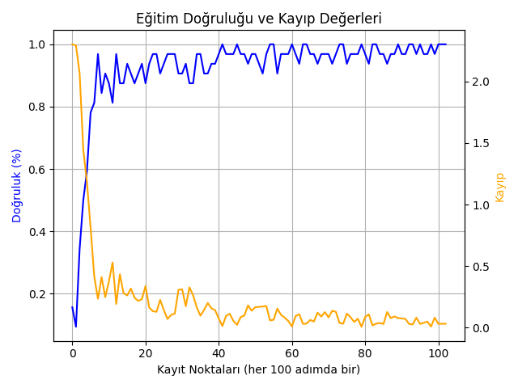

# MNIST-Tam-Proje

Bu proje, el yazısıyla yazılmış rakamları tanıyabilen bir yapay zeka sistemini baştan sona
tamamen kendi yazılmış sinir ağı ile gerçekleştirme amacıyla geliştirilmiştir. MNIST veri
seti kullanılarak, herhangi bir dış yapay zeka kütüphanesi kullanmadan, yalnızca NumPy
gibi temel bilimsel kütüphanelerle sinir ağı sıfırdan kodlanmıştır.
Projenin temel hedefi, hem teorik olarak derin öğrenme mantığının kavranmasını
sağlamak hem de uygulamalı bir arayüz ile son kullanıcının sisteme etkileşimli şekilde veri
girişi yapabilmesini mümkün kılmaktır.

# Kurulum/Kullanım

Projeyi için gerekli bağımlılıkları yüklemek için lütfen install_requirements.py dosyasını terminalinizde "python install_requirements.py" komudunu kullanarak çalıştırınız yoksa PROJELER AÇILMAYACAKTIR/HATA VERECEKTİR

MNIST projesini açmak için terminalinizde "python gui.py" komudunu çalıştırınız. (MNIST-Tam Proje klasöründe olmalısınız o sırada)MNIST projesini açmak için terminalinizde "python gui.py" komudunu çalıştırınız. (MNIST-Tam Proje klasöründe olmalısınız o sırada)

# Teknik Özellikler

• Sinir Ağı Mimarisi:

•Giriş katmanı: 784 nöron (28x28 piksel)

•Gizli katmanlar: 256 ve 128 nöron

•Aktivasyon fonksiyonları: ReLU (gizli katmanlar), Softmax (çıkış katmanı)

•Eğitim Detayları:

•Kayıp fonksiyonu: Categorical Cross Entropy

•Erken durdurma mekanizması (patience = 20, delta = 1e-6)

•Öğrenme oranı: 0.05 (zamanla azalan)

•Batch size: 32

•Normalizasyon: -1 ila 1 aralığına getirilen girdi değerleri Özel veri ekleme (>=300 örnek)

•Eğitim Sonuçları:

•Test Doğruluğu: ~%98

•GUI tahmin doğruluğu: görsel olarak doğrulanabilir

# GUI Arayüz Detayları

• Kullanılan Teknoloji: PyQt6

•Temel Özellikler:

•Fareyle çizim yapılabilen alan (280x280 piksel)

•"Tahmin Et" ve "Temizle" butonları

•Çıktıyı anlık olarak gösteren tahmin paneli

•Kullanıcının yeni veri etiketleyip kaydedebileceği alan

•Veri Kaydetme: Kullanıcıdan alınan çizim, merkezlenip normalize edilerek custom_data/

klasörüne image_.npy ve label_.npy olarak kaydedilir.

# Kullanılan Kütüphaneler

• NumPy: Tüm matrissel işlemler

•Matplotlib: Eğitim sürecindeki doğruluk ve kayıp grafiklerinin çizimi

•SciPy: center_of_mass ve shift ile çizimlerin merkezlenmesi

•PyQt6: Grafiksel kullanıcı arayüz (GUI)

•Gzip / OS: MNIST veri setinin açılması ve dosya yönetimi

# Yenilikçi Yönler

• Sinir ağı tamamen elle yazıldı, PyTorch/TensorFlow gibi framework'ler kullanılmadı.

•Erken durdurma ve adaptif öğrenme oranı manuel olarak entegre edildi.

•Kullanıcı arayüzü sadece tahmin için değil, aynı zamanda yeni veri oluşturma ve eğitime

dahil etme için tasarlandı.

•Gerçek zamanlı tahmin ve merkezleme sistemiyle düşük kaliteli çizimlerin doğruluğu
artırıldı.

•Otomatik olarak en iyi modelin kaydedilmesi ve grafiklerin indeksli olarak saklanması
sağlandı.

# Ekler 

• Eğitim Grafikleri:

Kayıp ve doğruluk grafikleri:

• Eğitilen Model:

graph/ klasörü modelWeights/ ve best_model/ klasörlerinde ağırlık ve bias dosyaları (final_weight_npy, final_bias.npy)

• Kayıt Edilen Özel Veriler: custom_data/ klasörü

• GUI Kodları: gui.py

• Model ve Eğitim Kodları: Wow.py

# Şu An Kullanılan Eğitimin Sonucu (En Güncel ve Stabil Model Çıktısı)

